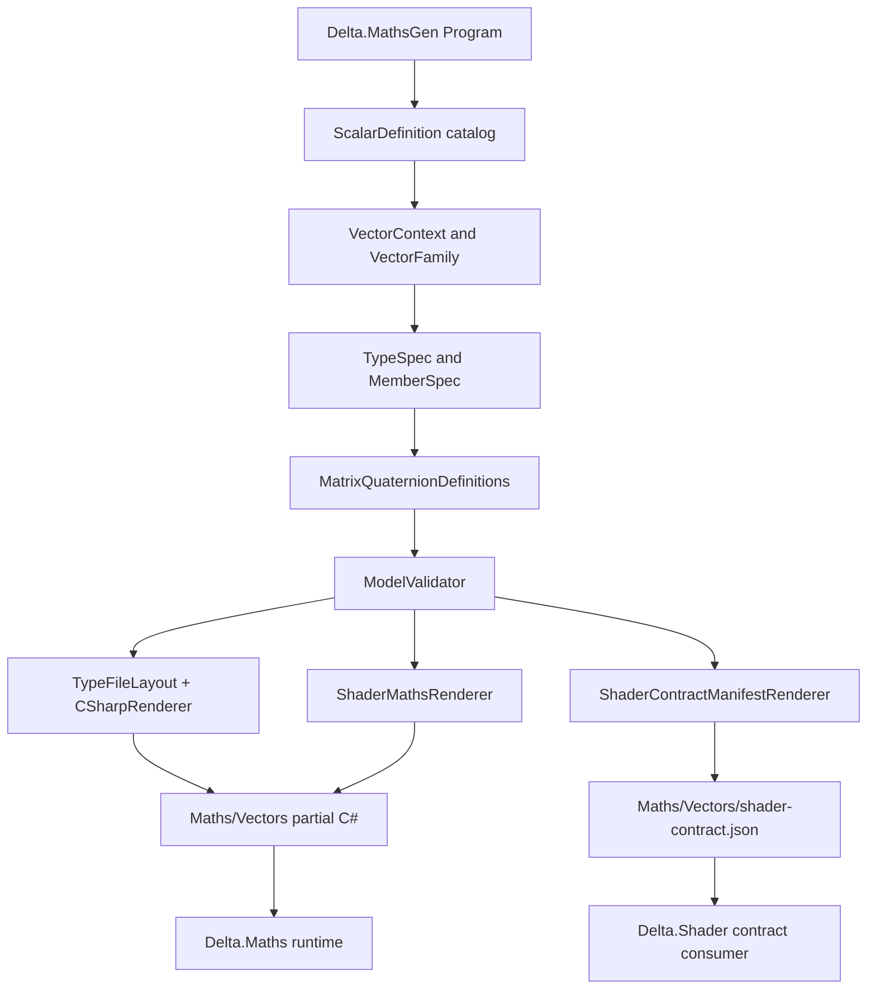
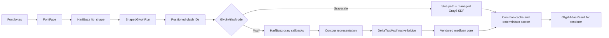

# MathsGen, Delta.Maths and Delta.Text architecture

This document describes the implementation that exists in the workspace. It
is intentionally kept beside `MathsGen`, because the generator model owns the
generated API and shader contract. It is not a promise that an unimplemented
backend or a future shader intrinsic already exists.

## Generation lifecycle

`Delta.MathsGen` is a console application targeting `net8.0`. Its only command
argument is the generated vectors directory, normally `Maths/Vectors`.

The lifecycle is:

1. `Program` reads the fixed `ScalarTypes.All` catalog.
2. Each scalar is combined with dimensions 2, 3 and 4 to create a
   `VectorFamily` and its `VectorContext`.
3. `MatrixQuaternionDefinitions.Create()` adds `float4x4` and `quaternion`.
4. `ModelValidator` checks scalar conversions, vector rules, member
   signatures, maths forwarding and shader metadata.
5. `TypeFileLayout` groups each type's members by `TypePart` and
   `CSharpRenderer` renders one partial file per non-empty part.
6. `ShaderMathsRenderer` renders the lowercase `maths` forwarding facade.
7. `ScalarMathsScanner` reads the handwritten `Maths*.cs` files and
   `ScalarMathsRenderer` emits the generated scalar facade.
8. `ShaderContractManifestRenderer` serializes the same model to
   `shader-contract.json` schema `1.1.0`.
9. `GeneratedFileWriter` validates names, removes files listed as stale in
   `.delta-generated-files`, writes every current source, and updates that
   manifest.

Generation is deterministic: ordering uses ordinal name/signature ordering and
the process culture is invariant. Generated files are outputs, never editing
targets. Add a type, member, or shader symbol in the model and regenerate;
do not patch `Maths/Vectors` by hand.

## Generator model

`ScalarDefinition` is the scalar policy table. It contains the CLR name,
zero literal, capability flags, parsing behavior, safe-normalization threshold
and conversion targets. `ScalarCapabilities` is a flags enum used by vector
rules to decide whether arithmetic, trigonometry, fixed-point or other
operations can be emitted.

`VectorContext` is the derived context for one scalar/dimension pair. It
provides the generated type name, component names and matching boolean vector
name. `VectorFamily` owns the common declaration: fields, constructors,
indexer, equality, parsing, operators, swizzles and catalog-driven functions.
`VectorFunctionCatalog` and `VectorOperatorCatalog` contain reusable rules;
their `AppliesTo` checks keep unsupported scalar/dimension combinations out of
the model.

`TypeSpec` is a complete generated type. `MemberSpec` is its base declaration
node; `FieldSpec`, `ConstructorSpec`, `FunctionSpec`, `OperatorSpec`,
`PropertySpec` and `IndexerSpec` provide the concrete members. `TypePart`
controls partial-file placement (`Core`, `Operators`, `Common`, `Geometry`,
`Trigonometry`, `Exponential`, `Relational`, and `Swizzles`). `FunctionTargets`
controls whether a function is emitted on the CLR type, the lowercase
`maths` facade, or both.

Function bodies are stored as readable source fragments. The model deliberately
does not parse C# expressions; validation is concerned with declarations and
signatures, while the C# compiler validates the emitted body.

## Shader metadata model

The model distinguishes stable contract categories from dynamic ABI names:

| Model value | JSON output | Meaning |
| --- | --- | --- |
| `ShaderMappingKind.Unsupported` | `"Unsupported"` | no automatic shader mapping |
| `ShaderMappingKind.Builtin` | `"Builtin"` | maps to a GLSL builtin/operator |
| `ShaderMappingKind.Helper` | `"Helper"` | maps to a registered Delta helper |
| `ShaderCapability.Vector` | `"vector"` | vector capability |
| `ShaderCapability.Matrix` | `"matrix"` | matrix capability |
| `ShaderCapability.Quaternion` | `"quaternion"` | quaternion helper capability |
| `ShaderCapability.Std430` | `"std430"` | storage/layout capability |
| `ShaderZoneKind.DeltaMaths` | `"Delta.Maths"` | owning shader zone |
| `ParameterModifier.Out` | `"out"` in C# | output parameter |
| `ParameterModifier.Ref` | `"ref"` in C# | ref parameter |

All three model families include `None` and `Unknown`. `Unknown` is not a
fallback serialization value: a supported mapping with an unknown capability
or zone fails validation, and an unknown parameter modifier fails validation or
rendering. This prevents an extension from silently becoming an incorrect
shader symbol. `None` remains available for an explicitly absent value.

`GlslName`, `GlslType`, `GlslReturnType`, `parameterGlslTypes` and all other
GLSL type/name fields remain strings. They are ABI spelling, not closed CLR
categories. The renderer converts the closed model enums back to the existing
manifest strings, so the manifest shape and text remain unchanged.

The manifest contains type layout (`columnMajor`, `alignment`,
`matrixStride`), stage names, constructors, swizzles, function identities and
GLSL signatures. `float4x4` is four sequential `float4` columns and uses
column-vector CPU/GLSL semantics. `quaternion` is a sequential `vec4` with
`(x, y, z, w)` storage. `double` and `fix` vector families remain CPU-only.

## Delta.Maths runtime boundary

`Maths` is a portable `netstandard2.0`/`netstandard2.1` assembly. Generated
partial structs live in `Maths/Vectors`; handwritten scalar and extension
facades live in the project root. The generated `maths` class forwards
shader-like lowercase calls such as `maths.normalize`, while the handwritten
`Maths` class remains the stable scalar API. Consumers use values directly;
there is no runtime dependency on `MathsGen`, a renderer, Unity or
`System.Numerics`.

The matrix convention is independent of the source layout convention:

* left-handed world-space policy is used by the documented transform helpers;
* vectors are column vectors and `M * v` is the operation order;
* matrices are column-major as columns `c0` through `c3`;
* translation is in `c3.xyz` (`M14`, `M24`, `M34` in the public named fields);
* `CreateTRS` is `T * R * S`;
* Vulkan depth `0..1` and the negative viewport-height Y policy are projection
  and render decisions, not hidden flips in generic matrix multiplication.

These conventions are covered by the runtime matrix/quaternion and GLSL
conformance tests. A consumer that needs a new GPU-visible function should add
its declaration and contract in MathsGen, then regenerate and test the output.

## Delta.Text pipeline

`Delta.Text` is a renderer-neutral CPU project. It owns no XAML, Vulkan, SDL,
DeltaRender or shader code. Its public boundary is value-based:

* `FontKey` identifies source bytes by family, style and stable source ID;
* `FontFace` owns copied font bytes and HarfBuzz blob/face/font handles;
* `TextShapingRequest` carries text, em size, culture, direction and OpenType
  feature toggles;
* `ShapedGlyphRun` exposes immutable `ShapedGlyph` and `PositionedGlyph` memory,
  advances and bounds;
* `GlyphAtlasRequest` selects glyph IDs, pixel size, padding, distance range and
  `GlyphAtlasMode`;
* `GlyphAtlasResult` contains packed pages and per-glyph UVs, bounds, bearings,
  advances, stride and pixel memory.

The actual pipeline is:

Shaping and outline extraction use the pinned HarfBuzz runtime. HarfBuzz draw
callbacks translate move, line, quadratic, cubic and close events into the
neutral `GlyphContours` representation. The MSDF bridge accepts those contours,
returns RGB8 pixels and is copied/freed by the managed layer. The bridge uses
the vendored msdfgen core; FreeType is not an engine dependency. Grayscale is
the managed fallback and remains usable when the optional MSDF bridge is not
present. MTSDF is declared in the value enum but is intentionally unsupported.

Both atlas modes share glyph/request caches and deterministic page packing.
Cache identity includes font key, glyph ID, pixel size, padding, distance range
and mode. Repeated requests reuse the cached result; the renderer receives
glyph IDs and metrics rather than the original string.

### Native and platform boundary

The managed/native boundary is `NativeHarfBuzz`, `NativeHarfBuzzOutline` and
`NativeMsdf`, with `NativeLibraryResolver` loading beside the managed assembly.
Native handles are owned by `FontFace`; MSDF pixel allocations are owned by the
bridge until the managed copy is complete, then released through the explicit
free function. CI covers Linux x64, macOS arm64 and Windows x64 native smoke.
The managed contract does not claim that an arbitrary system HarfBuzz library
or an unbuilt bridge is available.

## Known limitations

* `MathsGen` has a model/renderer architecture, not a general C# parser; body
  fragments remain source strings.
* Shader consumers still need to register the manifest's `Builtin` and
  `Helper` identities. `Unsupported` entries are not registrations.
* The shader manifest currently describes the supported Delta.Maths surface;
  shader-only operations such as derivatives are outside MathsGen.
* Delta.Text's MSDF route requires the native bridge and its packaged HarfBuzz
  assets. The managed Gray8 SDF path is the fallback.
* MTSDF, GPU atlas uploads, Vulkan integration, shaping UI controls and font
  fallback selection are not implemented in Delta.Text.
* Atlas fixtures and native packaging/CI remain the selected follow-up work in
  `DeltaText/TODO.md`; this document does not turn those items into completed
  features.

## Ownership rule

MathsGen owns declarations and generated contract text. Maths owns the runtime
types and tests that consume the generated output. Delta.Text owns shaping,
outline extraction, atlas generation and native lifetime. DeltaShader consumes
the generated manifest; DeltaRender consumes positioned glyphs and atlas pages.
None of those consumers should duplicate producer metadata to bypass a missing
declaration.
